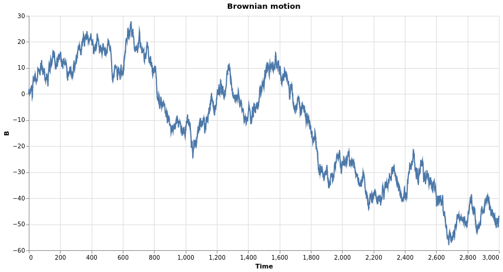
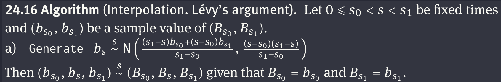
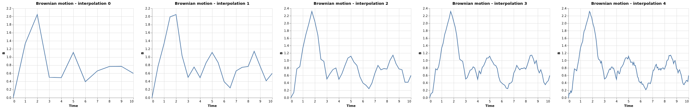

# Brownian Motion Simulation

This repo is a partial implementation of the chapter 'Simulation of Brownian motion' from the book 'Brownian Motion: a guide to random processes and stochastic calculus', by René L. Schilling.

### Independent Increments

The first algorithm implemented to generate a Brownian path uses stationary and independent increments:

 

A path created with this method is presented below.

 

This method works particularly well if the step size $\delta = t_{j}- t_{j-1}$ is constant for all $j$, in this case one has to generate only $y \stackrel{s}{\sim} N (0,\sigma)$ repeatedly. A drawback of the method is, that any refinement of the discretization yields a new simulation and, thus, a different path. 

### Interpolation

To get a refinement of an already simulated path, one can use the idea of Lévy's original argument.

 

A path with 10 sampled BM interpolated 4 times

 
