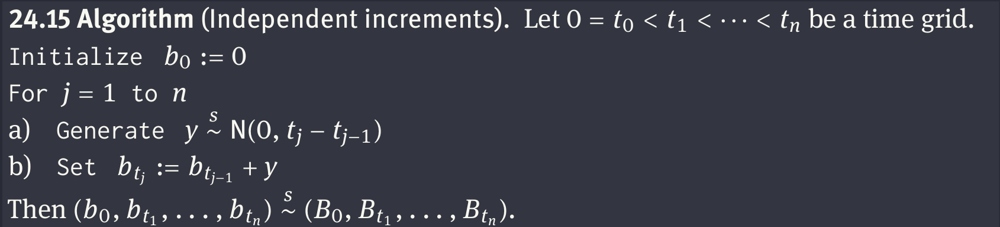

# Brownian Motion Simulation

This repo is a partial implementation of the chapter 'Simulation of Brownian motion' from the book 'Brownian Motion: a guide to random processes and stochastic calculus', by René L. Schilling.

The first algorithm implemented to generate a Brownian path is the use of stationary and independent increments:
 

